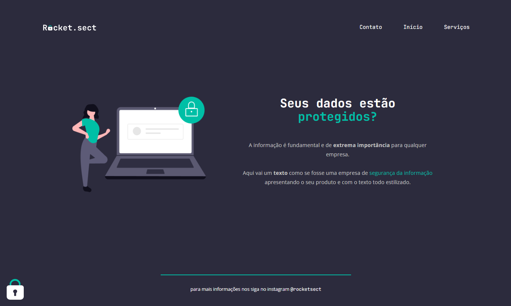

# Explorer Projeto Avançado 01 

> Nível 2 do Explorer

Último desafio do Nível 2 do curso Explorer da Rocketseat feito com base em um projeto do figma.

[🔗 Clique aqui para acessar o projeto](https://loren175.github.io/Adnvc-01)

## 🚀 Tecnologias

- HTML
- CSS
- Git e Github

## 📞 Contato

>rafael.loren175@gmail.com

## 👾 Discord

>rafas#7622